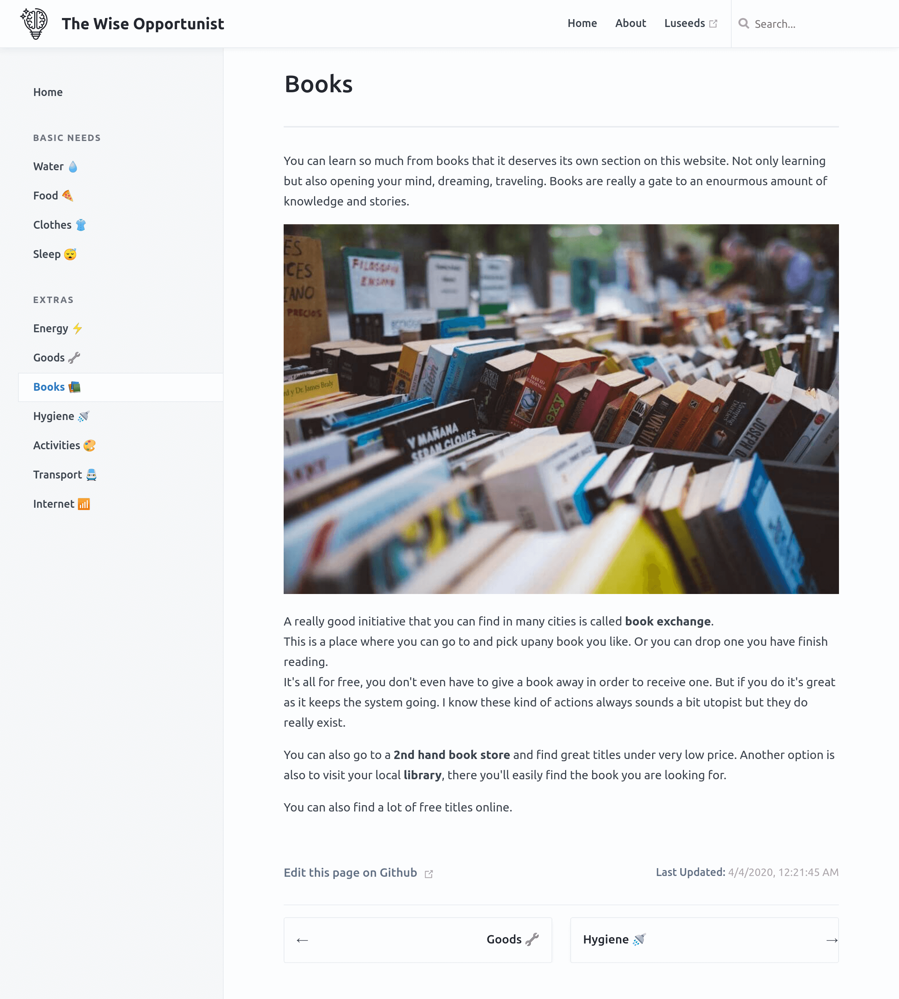

# VuePress theme - Gitbook inspired

A [VuePress](https://vuepress.vuejs.org) theme inspired by [Gitbook](https://docs.gitbook.com/).



I really love their clean and minimalist style, so I decided to do a theme for VuePress.

It is **not** 100% identical to a Gitbook page, some choices are made to respect VuePress limitations.
It is based on `@vuepress/theme-default` and only extend it.

You can see a live demo on the [opportunist website](https://opportunist.luseeds.com) by [luseeds](https://luseeds.com)

> Want to add your website too? Send me a PR. :v:

## Installation

`npm install -S vuepress-theme-book`

## Usage

In your `.vuepress/config.js` file simply add:

```js
module.exports = {
  theme: "book",
  ...
}
```

## Configuration

There is no specific configuration for this theme.
However, as we're extending the default theme you can configure all of their options.

Find out more on [the default theme config page](https://v1.vuepress.vuejs.org/theme/default-theme-config.html)
All these config can be added to your `.vuepress/config.js` file under the key `themeConfig`.

Also, if you want to change the color palette, you can modify your `.vuepress/styles/palette.styl`.
The available variables are (including the [default theme ones](https://v1.vuepress.vuejs.org/config/#palette-styl)):

```stylus
// colors
$accentColor = #3eaf7c
$textColor = #3b454e
$titleColor = #242a31
$borderColor = #eaecef
$sidebarHeaderColor = #697179
$sidebarBgColor = #f5f7f9
$lightDelimiterColor = #e6ecf1
$codeBgColor = #282c34
$arrowBgColor = #ccc
$badgeTipColor = #42b983
$badgeWarningColor = darken(#ffe564, 35%)
$badgeErrorColor = #DA5961

// layout
$navbarHeight = 4rem
$sidebarWidth = 18.625rem
$contentWidth = 740px
$homePageWidth = 960px

// responsive breakpoints
$MQNarrow = 959px
$MQMobile = 719px
$MQMobileNarrow = 419px
```

## License

[MIT](https://github.com/cyrilf/vuepress-theme-book/blob/master/LICENSE)

## Contributing

I would be more than happy to receive feedback/issues/pull request, so don't hesitate.

- Check the open issues or open a new issue to start a discussion around your feature idea or the bug you found.
- Fork repository, make changes and send a pull request

Thank you!
